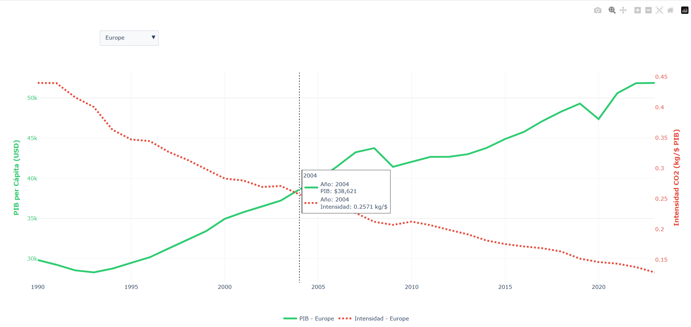
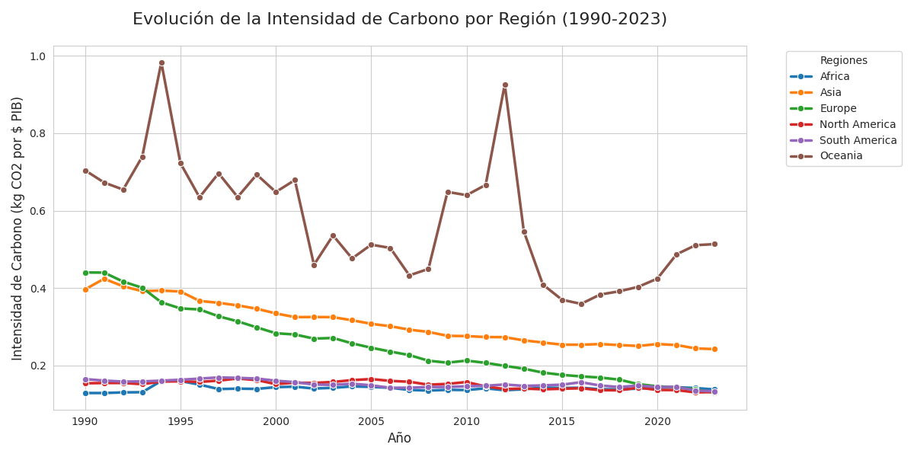

# 🌍 Carbon Emissions Data Pipeline (Medallion Architecture)


Este proyecto implementa un pipeline de datos **End-to-End** para analizar las emisiones de carbono globales y su relación con el crecimiento económico (PIB/GDP). Utiliza una **Arquitectura Medallion** procesada con **PySpark** y desplegada íntegramente mediante contenedores **Docker**.


## 🎯 Objetivo del Proyecto
Extraer, transformar y visualizar datos históricos de emisiones de $CO_2$ para identificar patrones de **"desacoplamiento económico"**: países que logran aumentar su riqueza (PIB) mientras reducen simultáneamente su huella de carbono.

## 🏗️ Arquitectura Técnica
El pipeline se divide en tres capas lógicas para asegurar la integridad, calidad y trazabilidad del dato:

* **Capa Bronze (Ingesta):** Extracción de datos crudos desde fuentes externas (OWID) y persistencia en formato bruto.
* **Capa Silver (Limpieza):** Filtrado de valores nulos, normalización de esquemas, tipado de datos y validación de códigos ISO de países.
* **Capa Gold (Negocio):** Agregaciones complejas por regiones geográficas, décadas y cálculo de métricas de **Intensidad de Carbono** (Emisiones / PIB).
* **Visualización:** Generación automática de dashboards interactivos en HTML y reportes estadísticos avanzados.

## 🛠️ Stack Tecnológico
* **Lenguaje:** Python 3.11
* **Motor de Procesamiento:** PySpark (Spark Engine 3.4.0)
* **Infraestructura:** Docker & Docker Compose
* **Librerías de Visualización:** Plotly Express (Mapas animados), Seaborn y Matplotlib.
* **Entorno de Ejecución:** Java 11 (OpenJDK) para máxima estabilidad con Spark.

## 🚀 Cómo Ejecutar
Este proyecto está completamente **dockerizado**, eliminando la necesidad de instalar Spark, Java o Hadoop localmente.

1.  **Clonar el repositorio:**
    ```bash
    git clone [https://github.com/tu-usuario/carbon-emissions-pipeline.git](https://github.com/tu-usuario/carbon-emissions-pipeline.git)
    cd carbon-emissions-pipeline
    ```
2.  **Lanzar el entorno:**
    ```bash
    docker-compose up --build
    ```
3.  **Resultados:** Los reportes aparecerán automáticamente en la raíz de tu proyecto:
    * `viz_animacion_global.html` (Mapa interactivo temporal)
    * `carbon_trends_plot.png` (Gráfico de tendencias estático)
    * `dashboard_regiones_interactivo.html` (Análisis comparativo)

## 🧠 Decisiones de Ingeniería
* **Dockerización:** Uso de volúmenes y redes aisladas para garantizar la portabilidad total entre Windows, macOS y Linux.
* **Java 11 sobre 17:** Decisión técnica basada en la estabilidad del Garbage Collector de la JVM y la compatibilidad de acceso a memoria de Spark.
* **Almacenamiento en Parquet:** Uso de almacenamiento columnar en las capas intermedias para optimizar el rendimiento de las consultas y reducir el almacenamiento.

## 📊 Análisis de Resultados y Conclusiones

Tras ejecutar el pipeline, los datos procesados en la **Capa Gold** revelan insights críticos sobre la transición energética global:

### ⚡ El Desacoplamiento Económico
El análisis muestra una tendencia clara de **desacoplamiento** en economías avanzadas (especialmente en Europa y Norteamérica). Mientras que el PIB per cápita (GDP) continúa creciendo, la intensidad de carbono (emisiones por unidad de PIB) ha disminuido drásticamente desde los años 90. Esto valida la eficiencia de las políticas de transición energética.

<p align="center">
  
</p>

### 🌍 Brecha Regional
* **Europa:** Lidera la reducción de intensidad de carbono, optimizando sus procesos industriales.
* **Asia:** Presenta el crecimiento más acelerado en emisiones totales, correlacionado con su explosión industrial, aunque empieza a mostrar picos de estabilización en la última década.
* **África:** Mantiene una intensidad de carbono baja por país, pero con una dependencia crítica de fuentes de energía externas para su desarrollo económico.

<p align="center">
  
</p>

### 📈 Métricas Clave Generadas
* **Media de Intensidad de Carbono por Década:** Permite observar la velocidad de descarbonización regional.
* **Relación GDP vs Co2:** Identifica qué países son más "eco-eficientes" (generan más riqueza con menos emisiones).


<p align="center">
  
</p>
---

## 📂 Estructura del Proyecto

```text
carbon-emissions-pipeline/
├── data/                   # Datos organizados por capas (Medallion)
│   ├── bronze/             # Datos crudos (Raw)
│   ├── silver/             # Datos limpios y tipados
│   └── gold/               # Agregaciones de negocio
├── scripts/                # Scripts de procesamiento PySpark
│   ├── bronze_layer.py
│   ├── silver_layer.py
│   └── gold_layer.py
├── visualizations/         # Lógica de generación de reportes
├── Dockerfile              # Configuración de imagen (Python + Java 11)
├── docker-compose.yml      # Orquestación de contenedores
├── main.py                 # Punto de entrada del pipeline
└── README.md               # Documentación